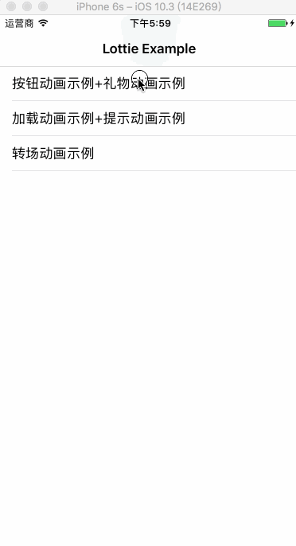
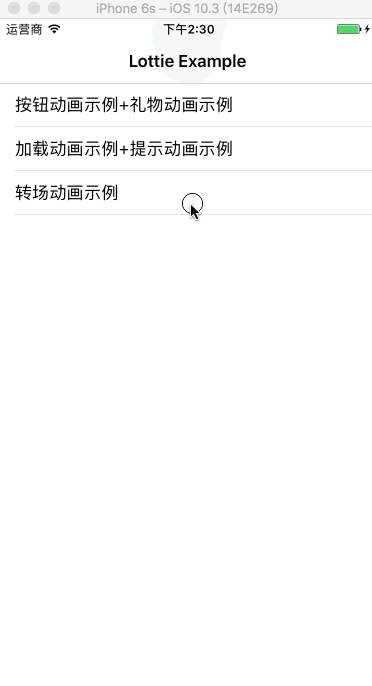

Lottie Example 
============

以下是lottie-iOS的应用示例：

- 启动(splash)动画

	动画.gif)

- 上下拉刷新动画

	

- 加载(loading)动画+提示(tips)动画

	动画+提示(tips)动画.gif)

- 按钮(button)动画+礼物(gift)动画

	动画+礼物(gift)动画.gif)

- 转场动画

	

